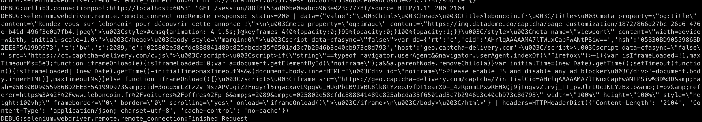

# Marginx-extract

## Overview

This scraper is designed to extract data from Leboncoin, gathering information from 50 paginations, with each page containing up to 35 listings. The scraper is robust and efficient, and doesn't store duplicate listings, but there is one aspect it currently does not cover.
Leboncoin employs datadome as a security measure, implementing both server-side and client-side protection. During the first page load, an Image puzzle captcha might be requested, depending on datadome's factors. Unfortunately, the current version of the scraper does not handle this captcha.


### Requirements
To ensure the scraper works successfully, it must be executed without the headless mode, allowing user interaction with the browser to solve captchas manually. Additionally, it is important to avoid consistent patterns in scraping behavior, as datadome is a powerful security system that might block your IP in response.

### Limitations
The current version of the scraper cannot be run on Ubuntu Linux with headless mode. However, it has been tested on an EC2 instance to check for captcha requests. Despite the machine being in the same region as the website, captchas were still encountered.


### Future Solution
To overcome the captcha challenge, a proposed solution involves implementing an Image processing and image recognition software. This software would be able to identify the puzzle on the image and determine the precise position to drag the block. The Leboncoin captcha employs one image as the foreground block and another as the background image, and this advanced image recognition system would enable seamless automation in the presence of captchas.

## Environment and dependency setup

### Create a new virtual environment
`python3 -m venv venv`  This creates an env folder in the directory 

Activate the virtual environment `source venv/bin/activate`

run ```pip3 install -r requirements.txt``` this installs all the packages needed

run the scraper `python src/extract.py`